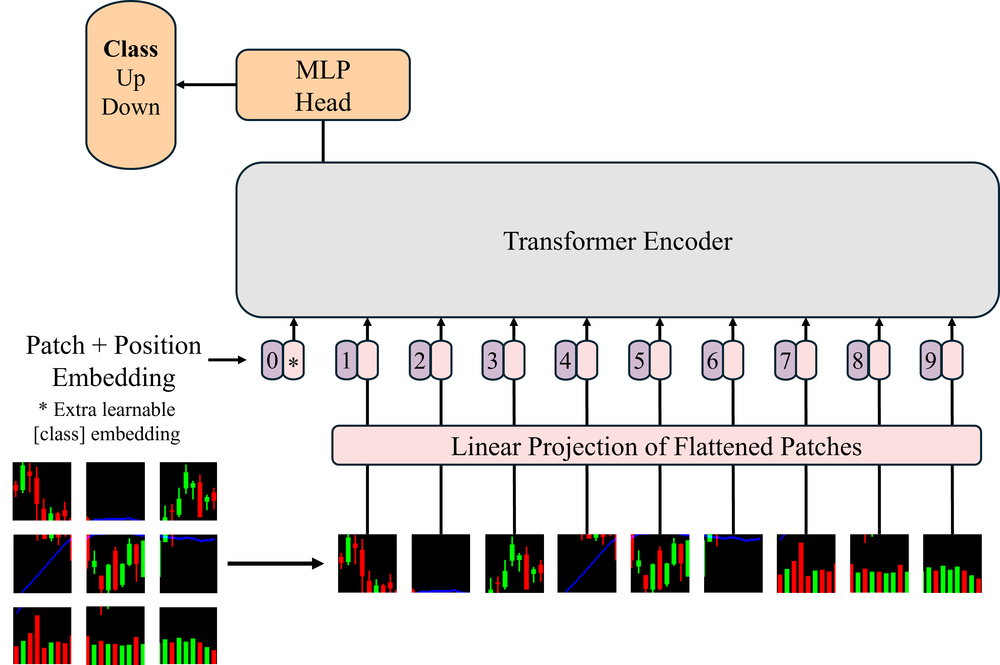

# Learning Stock Price Signals from Candlestick Chart Via Vision Transformer



## Overview

A deep learning framework for predicting stock return direction using Vision Transformers (ViT) on candlestick chart images.

Key features:

- Input: 25-day RGB candlestick charts with price, volume, and moving average
- Model: Vision Transformer with self-attention for global + local price pattern recognition
- Baselines: LSTM, MLP, CNN20, CNN5 for performance comparison
- Output: Binary classification — Up or Down in the next 20 trading days
- Includes portfolio backtesting and Grad-CAM visualizations

## Citation 
If you find this work useful for your research, please cite:

```
@article{byun2025chartvit,
  title={Learning Stock Price Signals from Candlestick Chart Via Vision Transformer},
  author={Byun, Jun Young and Na, Yosep and Song, Jae Wook},
  journal={Available at SSRN 5224805},
 year={2025}
}
```
